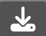

This is a [Next.js](https://nextjs.org/) project bootstrapped with [`create-next-app`](https://github.com/vercel/next.js/tree/canary/packages/create-next-app).

## Getting Started

First, run the development server:

```bash
npm run dev
# or
yarn dev
# or
pnpm dev
# or
bun dev
```

## How To Use

Start drawing right away or change the color, brush size, or background!

- If you'd like to restart, just click  or if you'd like to erase what you've done click !

## Saving Your Work

- You can save your work by clicking the  icon.

- You can load in your work by clicking the  icon.

- You can delete your saved work by clicking the  icon.

- You can download your work by clicking the  icon.

Have Fun!
